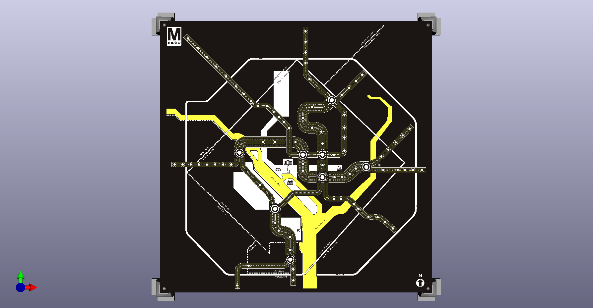
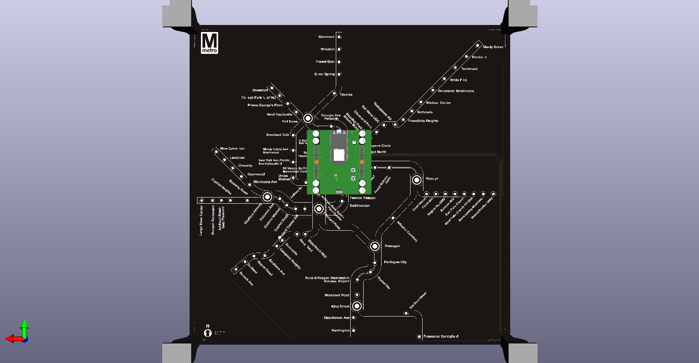

# dc-map-500x500
This board requires the use of a backpack to operate. Currently the only developed backpack is [the ESP32 module](https://github.com/alorman/esp32-backpack).  

## Images

## BOM
(no interactive BOM here, unfortunately)
| Qty  | MPN        | Supplier | Reference    | Value | Package     | Type | Notes | Link                                                                                                     |
|------|------------|----------|--------------|-------|-------------|------|-------|----------------------------------------------------------------------------------------------------------|
| 1140 | SMD0805-0R | Any      | LED1-LED1140 |       | SK6805-1515 | SMD  |       | http://www.normandled.com/upload/201903/SK6805-1515%20LED%20Datasheet.pdf                                |
| 1    |            |          | U1           | DNP   |             |      | DNP   | https://www.mouser.com/ProductDetail/Vishay-Semiconductors/VCNL4010-GS08?qs=s4XK1XdnRik7x1pyEKUO2w%3D%3D |                                                                         |

## Pick and Place Files
[Pick and Place File](KiCad/500x500-dc-metro-map/PNP-Files/500x500-rev00-pnp.txt)

## Fab Instructions

| | |
|-------------------|---------------:|
| Height (mm)       | 500            |
| Width (mm)        | 500            |
| Layers            | 2              |
| Thickness (mm)    | 1.6            |
| Solder Mask       | Matte Black    |
| Silkscreen        | White          |
| Copper Thickness  | 1 oz           |
| Min Spacing       | 6/6mil         |
| Min Hole Size     | 6mil           |
| Via Process       | Tented         |
| Surface Treatment | HASL-Lead Free |
| Special Notes     | See below      |

## Special Fab Notes
This board is large, expensive and relies on pick-and-place assembly to get right. (I mean, you can TRY to solder 1,044 LEDs manually, but even doing 100 is a giant pain).

Since this board pushes the limits of most fab houses (just on size), it's worth reaching out to them by email to see if they can support. 

I can confirm the following fab houses can build this board.
- Elecrow
- PCBWay
- AllPCB
- Seeed Studio
- Bittele
- OurPCB
- PCBonline

Although their prices vary wildly.

